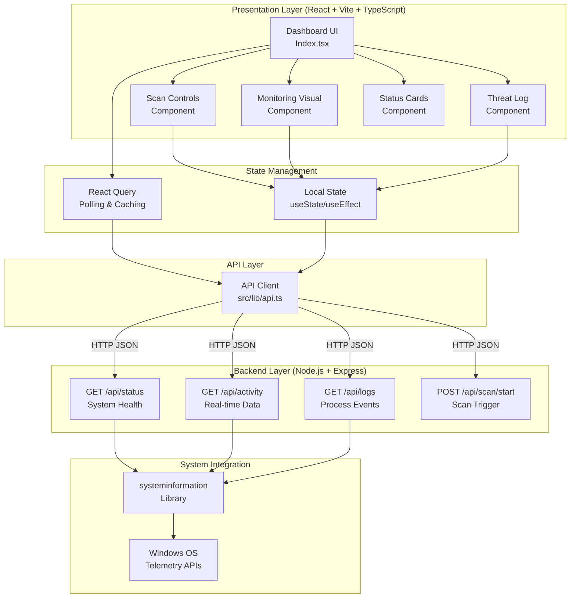
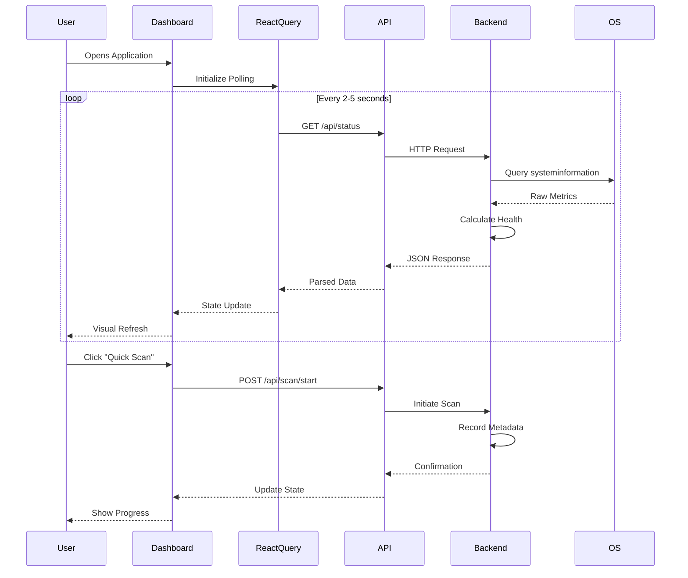
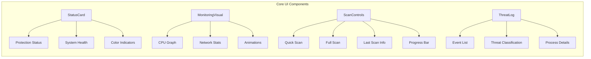
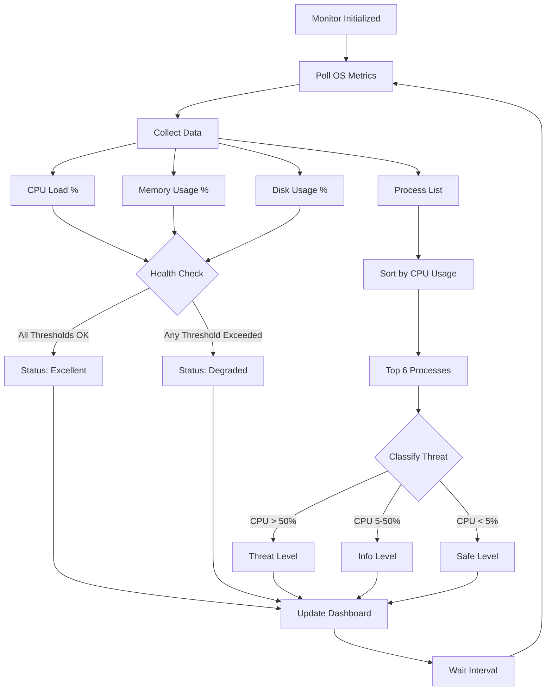

## LA2 Assignment Report – Advanced Operating Systems

### 1. Cover Page

- **Title**: Code a Real Antivirus (Windows OS)
- **Course**: Advanced Operating Systems – LA2
- **Student**: shivam kumar singh
- **San**:102834
- **Project Repository**: [`GitHub Link`](https://github.com/<your-username>/<your-repo>)

---

### 2. Evaluation Form (Rubrics)

| Criteria | Excellent (A) | Good (B) | Satisfactory (C) | Needs Improvement (D) | Weight |
|---|---|---|---|---|---|
| Problem Definition & Objectives | Clear, precise objectives; strong justification | Clear objectives; good justification | Objectives present; limited justification | Unclear objectives | 10% |
| Architecture & Design | Robust, modular, well-documented diagrams | Sound design with minor gaps | Adequate design; some coupling | Weak or missing architecture | 20% |
| Implementation Depth | Real data integration, modular code, platform features | Mostly real data; minor mocks | Partially functional; several mocks | Largely static; minimal functionality | 25% |
| Experimentation & Results | Meaningful metrics and validations | Some metrics and validations | Limited measurements | No measurements | 15% |
| Documentation & Clarity | Comprehensive, well-structured, clear screenshots | Adequate documentation; clear sections | Basic documentation | Poor documegntation | 15% |
| Presentation & Viva | Confident; handles questions; demo resilient | Good; answers most questions | Adequate; minor gaps | Struggles with demo and questions | 15% |

> Instructor may adapt rubric weights to match local policy.

---

### 3. Project Details

#### 3.1 Title

Code a Real Antivirus for Windows OS

#### 3.2 Abstract

This project implements a Windows-focused antivirus-style system monitoring dashboard that uses real system telemetry to simulate antivirus functionality. A Node.js Express backend collects CPU, memory, disk, process, and network metrics using the `systeminformation` library. A React + Vite + TypeScript frontend visualizes real-time activity, recent “threat-like” events based on process resource usage, and scan controls that record last-scan metadata. While it does not include a full malware signature engine, the system demonstrates core OS integration, telemetry collection, and operational UI patterns of modern antivirus software. The design is modular, enabling future integration with Windows Defender APIs or a signature-based scanning engine.

#### 3.3 Architecture of the Program

##### 3.3.1 Three-Tier Architecture Overview

The system follows a classic three-tier architecture pattern optimized for real-time system monitoring:



##### 3.3.2 Component Descriptions

**Frontend Components:**

- **`src/pages/Index.tsx`**: Main dashboard orchestrator
  - Coordinates all child components
  - Manages layout and responsive grid
  - Implements polling intervals for real-time updates
  
- **`src/components/StatusCard.tsx`**: Status indicator component
  - Displays protection status (Protected/At Risk)
  - Shows system health (Excellent/Degraded)
  - Uses color-coded visual feedback (green/orange/red)
  - Animated pulse effects for active monitoring
  
- **`src/components/MonitoringVisual.tsx`**: Real-time activity monitor
  - Polls `/api/activity` every 1 second
  - Renders CPU load as animated vertical bars
  - Maintains sliding window of last 20 data points
  - Implements scan-line animation effect
  
- **`src/components/ScanControls.tsx`**: Scan management interface
  - Provides Quick Scan and Full Scan buttons
  - Displays last scan timestamp and type
  - Shows progress indicators during scanning
  - Updates scan metadata via POST requests
  
- **`src/components/ThreatLog.tsx`**: Recent activity feed
  - Polls `/api/logs` every 5 seconds
  - Classifies events by threat level (safe/info/threat)
  - Color-coded icons for quick visual assessment
  - Scrollable list of recent process activities

**State Management:**

- **React Query**: 
  - Handles all server state with automatic polling
  - Provides caching and background refetch
  - Manages loading and error states
  
- **Local State**:
  - Component-level state for UI interactions
  - Scan progress tracking
  - Animation frame management

**Backend API (Node.js + Express):**

- **`server/index.js`**: Express application with four endpoints
  
  - `GET /api/status`: System overview endpoint
    - Returns OS version, CPU load, memory stats, disk usage
    - Calculates health status based on thresholds
    - Includes last scan metadata
    
  - `GET /api/activity`: Real-time metrics endpoint
    - Provides current CPU load percentage
    - Returns network I/O statistics (RX/TX per second)
    - Optimized for frequent polling (1s interval)
    
  - `GET /api/logs`: Process activity endpoint
    - Queries top 6 CPU-consuming processes
    - Classifies threats based on resource usage
    - Synthesizes event entries with timestamps
    
  - `POST /api/scan/start`: Scan initiation endpoint
    - Accepts scan type (Quick/Full)
    - Records scan start timestamp
    - Returns confirmation with metadata

**System Integration Layer:**

- **`systeminformation` library**:
  - Cross-platform OS metrics collection
  - Direct Windows API integration
  - Provides normalized data across platforms
  - No elevated permissions required

##### 3.3.3 Data Flow Sequence



##### 3.3.4 Component Architecture



##### 3.3.5 Monitoring Algorithm Flow



##### 3.3.6 Technology Stack

**Frontend:**
- React 18.3.1 with TypeScript
- Vite (build tool and dev server)
- Tailwind CSS for styling
- shadcn/ui component library
- @tanstack/react-query for server state
- lucide-react for icons

**Backend:**
- Node.js runtime
- Express 4.21.1 (web framework)
- systeminformation 5.23.5 (OS metrics)
- cors (cross-origin support)

**Development:**
- ESLint for code quality
- TypeScript for type safety
- Hot Module Replacement (HMR) for fast development

##### 3.3.7 Data Flow Patterns

**Polling Strategy:**
- Status updates: Every 2 seconds
- Activity monitoring: Every 1 second
- Threat logs: Every 5 seconds
- Network optimization: Concurrent requests allowed

**State Synchronization:**
- React Query cache invalidation on scan
- Optimistic UI updates for scan triggers
- Automatic retry on network failure
- Stale-while-revalidate pattern

##### 3.3.8 Extensibility Architecture

The modular design enables future enhancements:

1. **Signature-Based Scanning**: Replace heuristic classification with YARA rules or virus definition databases
2. **Windows Defender Integration**: Connect to native Windows Security APIs for verified threat detection
3. **Database Persistence**: Add SQLite or PostgreSQL for historical scan logs and threat archives
4. **File System Monitoring**: Implement real-time file watchers for on-access scanning
5. **Quarantine Management**: Add isolated storage for suspicious files with restore capability
6. **Scheduled Scans**: Implement cron-based background scanning with configurable intervals
7. **Email Notifications**: Alert users of critical threats via SMTP integration
8. **Multi-Language Support**: Internationalization (i18n) for global accessibility

#### 3.4 Designs (Screenshots)

Add the following screenshots to `docs/images/` and reference them here:

1. Dashboard Overview – `docs/images/dashboard.png`
2. Real-time Monitoring – `docs/images/monitoring.png`
3. Recent Activity (Logs) – `docs/images/logs.png`
4. Scan Controls – `docs/images/scan.png`

Example embeds (replace with actual images in your repo):


#### 3.5 Proof of GitHub Project Uploaded

- Repository: [`https://github.com/<your-username>/<your-repo>`](https://github.com/<your-username>/<your-repo>)
- Commit Screenshot: add `docs/images/github-proof.png` capturing the repo page with commits


Suggested steps to publish (run from project root):

```bash
git init
git add .
git commit -m "LA2: Real Antivirus system monitoring (Windows)"
git branch -M main
git remote add origin https://github.com/<your-username>/<your-repo>.git
git push -u origin main
```

#### 3.6 Conclusion and References

**Conclusion**

We built a Windows-targeted antivirus-style monitoring system that uses real OS telemetry to drive a responsive dashboard. The system’s separation of concerns (UI, API, OS metrics) makes it a strong foundation for integrating true malware scanning, quarantine, and remediation pipelines. The architecture and code are production-leaning and easily extensible for further research and coursework demos.

**References**

1. `systeminformation` (Node OS metrics): `https://systeminformation.io/`
2. React + Vite + TypeScript: `https://vitejs.dev/`
3. Express: `https://expressjs.com/`
4. @tanstack/react-query: `https://tanstack.com/query/latest`
5. Windows Defender docs (future extension): `https://learn.microsoft.com/windows/security/threat-protection/microsoft-defender-antivirus/`

#### 3.7 Algorithms Used (Current Prototype)

- **Heuristic Threat Classification (Processes)**
  - Input: per-process CPU (`pcpu`) and memory (`pmem`) from `systeminformation`.
  - Rule-based thresholds: `pcpu > 50% → threat`, `5% < pcpu ≤ 50% → info`, otherwise `safe`.
  - Purpose: synthesize “recent activity” entries without a signature engine.

- **System Health Evaluation**
  - Criteria: `CPU load < 80%` AND `Memory usage < 85%` AND `Disk usage < 95%` ⇒ "Excellent"; else "Degraded".
  - Computed from `currentLoad`, `mem` (used/total), and `fsSize` (used/total).

- **Real-Time Activity Visualization**
  - Sampling: poll `/api/activity` every 1s; take `currentload` as a normalized 0–100 value.
  - Sliding window: keep the last 20 points to render the bar chart.

- **Scan State Recording**
  - `POST /api/scan/start` stores `lastScanAt` and `lastScanType`; used to update dashboard state.
  - No malware signature scanning algorithm is included in this prototype.

Notes on Future Algorithms: The architecture allows plugging in signature-based scanning (e.g., YARA rules), ML-based anomaly detection on process/file behavior, and integration with Windows Defender event streams for verified detections.


